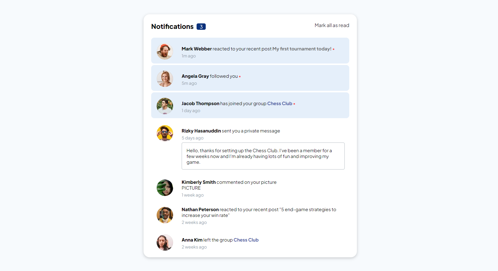
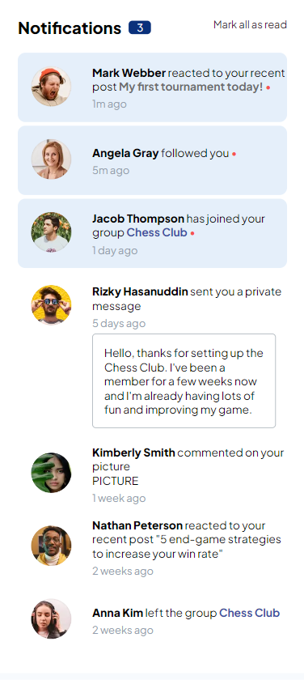

# Frontend Mentor - Notifications page

## Table of contents

- [Overview](#overview)
  - [The challenge](#the-challenge)
  - [Screenshots](#screenshots)
  - [Links](#links)
- [My process](#my-process)
  - [What I learned](#what-i-learned)
  - [Possible upgrades](#possible-upgrades)

## Overview

### The challenge

The challenge concerned building out this notifications page and getting it looking as close to the design as possible.

### Screenshots

### Links

Solution URL: https://rafalbodanka.github.io/notifications-page/

## My process

### What I learned

During this challenge, I improved my grid and transform workaround.

### Possible upgrades

 - "Unreading" the message/all messages.
 - On hover user's profile shortcut.
